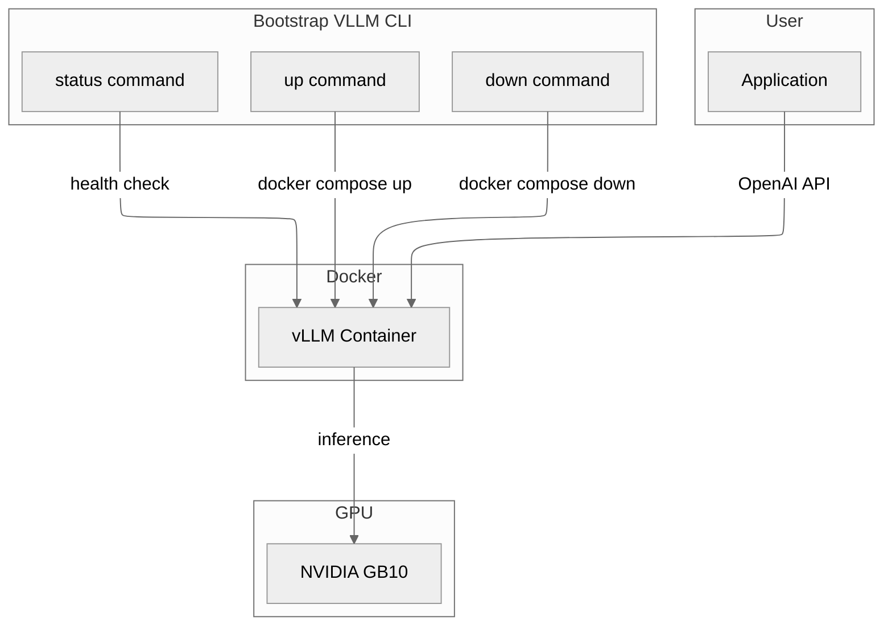
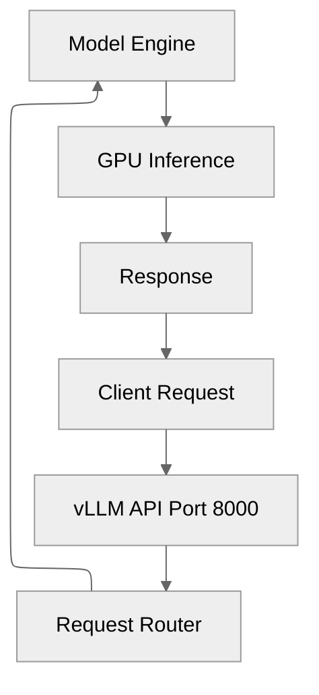
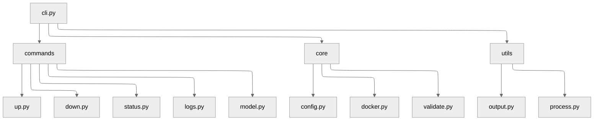

# vLLM on NVIDIA GB10

Run production-ready LLM inference on NVIDIA GB10 hardware with a single command.

## Why This Exists

Setting up vLLM on GB10 (Grace Blackwell) requires specific CUDA versions, container images, and memory tuning. This CLI handles that complexity so you can focus on using the API.

**What you get:**
- OpenAI-compatible API ready for any app that uses GPT
- Optimized for GB10 unified memory (128GB supports 70B models)
- Pre-configured for Blackwell GPU architecture (sm_121)
- Single command to start, stop, and monitor

## Quick Start

```bash
# 1. Configure
cp .env.example .env
# Edit .env to set your model and HF_TOKEN if needed

# 2. Start the server
uv run bootstrap-vllm up

# 3. Use the API
curl http://localhost:8000/v1/chat/completions \
  -H "Content-Type: application/json" \
  -d '{
    "model": "saricles/Qwen3-Coder-Next-NVFP4-GB10",
    "messages": [{"role": "user", "content": "Hello!"}]
  }'
```

### Switching profiles

`model switch <model_id>` auto-applies the correct image, quantization, context length,
GPU memory fraction, and vLLM runtime flags for any model in `KNOWN_MODELS`. Check `model list`
for what's configured.

```bash
uv run bootstrap-vllm model switch saricles/Qwen3-Coder-Next-NVFP4-GB10
uv run bootstrap-vllm model switch Qwen/Qwen2.5-72B-Instruct-AWQ
```

**Note:** `saricles/Qwen3-Coder-Next-NVFP4-GB10` is gated — accept the terms at
<https://huggingface.co/saricles/Qwen3-Coder-Next-NVFP4-GB10> before the first download.

## Usage

### Commands

| Command | Description |
|---------|-------------|
| `uv run bootstrap-vllm up` | Start vLLM server |
| `uv run bootstrap-vllm down` | Stop and remove containers |
| `uv run bootstrap-vllm status` | Show service health |
| `uv run bootstrap-vllm logs` | Stream container logs |
| `uv run bootstrap-vllm model switch MODEL` | Switch to a different model |
| `uv run bootstrap-vllm model current` | Show configured model |
| `uv run bootstrap-vllm model download MODEL` | Pre-download a model |
| `uv run bootstrap-vllm model list` | List cached models |

### Command Options

```bash
# Force recreate even if running
uv run bootstrap-vllm up --force

# Show last 100 lines without following
uv run bootstrap-vllm logs --no-follow --tail 100
```

### Configuration

All configuration is in `.env`:

| Variable | Default | Description |
|----------|---------|-------------|
| `VLLM_MODEL` | Qwen/Qwen2.5-72B-Instruct-AWQ | Model to serve |
| `VLLM_PORT` | 8000 | API port |
| `VLLM_MAX_MODEL_LEN` | 32768 | Maximum context length |
| `VLLM_GPU_MEMORY_UTILIZATION` | 0.90 | GPU memory fraction |
| `VLLM_QUANTIZATION` | (empty) | vLLM `--quantization` value (e.g. `compressed-tensors`) |
| `VLLM_NVFP4_GEMM_BACKEND` | (empty) | NVFP4 GEMM backend (`marlin` for GB10) |
| `VLLM_TEST_FORCE_FP8_MARLIN` | (empty) | Force FP8 Marlin kernels (NVFP4 profile) |
| `VLLM_USE_FLASHINFER_MOE_FP4` | (empty) | FlashInfer MoE FP4 toggle |
| `VLLM_MARLIN_USE_ATOMIC_ADD` | (empty) | Marlin atomic-add path |
| `VLLM_EXTRA_ARGS` | (empty) | Free-form `vllm serve` args (space-separated tokens) |
| `VLLM_MODEL_CACHE` | /opt/dev/models/cache/huggingface | HuggingFace cache directory |
| `HF_TOKEN` | (empty) | HuggingFace token for gated models |
| `VLLM_IMAGE` | nvcr.io/nvidia/vllm:25.12-py3 | Docker image |
| `VLLM_HOST_DEV` | /opt/dev | Host dev directory (mounted to /host/dev) |
| `VLLM_HOST_BIN` | /usr/local/bin | Host bin directory (mounted to /host/usr/local/bin) |
| `VLLM_HOST_HOME` | /home/YOUR_USER | Host home directory (mounted to /host/home) |

## Architecture

### System Overview

The CLI orchestrates Docker containers that run vLLM with GPU access.


*Figure 1: System components and their interactions*

### Request Flow

Every API request flows through vLLM to the GPU for inference.


*Figure 2: Request processing pipeline*

### CLI Module Structure

The CLI is organized into commands, core logic, and utilities.


*Figure 3: CLI source code organization*

## Technical Details

### Hardware Requirements

- NVIDIA GB10 (Grace Blackwell) or compatible
- NVIDIA Driver 570+
- Docker with NVIDIA Container Toolkit
- 128GB unified memory (supports up to 70B quantized models)

### Recommended Models

| Model | Memory | Best For |
|-------|--------|----------|
| saricles/Qwen3-Coder-Next-NVFP4-GB10 | ~43GB | Code generation (NVFP4, ~60 tok/s on GB10) |
| Qwen2.5-72B-Instruct-AWQ | ~45GB | General purpose (AWQ) |

Known models auto-apply their image, quantization flags, and NVFP4 runtime env vars via
`model switch`.

### API Endpoints

| Endpoint | Description |
|----------|-------------|
| `POST /v1/chat/completions` | Chat completions (OpenAI-compatible) |
| `POST /v1/completions` | Text completions |
| `GET /v1/models` | List available models |
| `GET /health` | Health check |
| `GET /metrics` | Prometheus metrics |

### Troubleshooting

| Symptom | Cause | Solution |
|---------|-------|----------|
| Container fails to start | Missing NVIDIA runtime | Install NVIDIA Container Toolkit |
| CUDA graph errors | sm_121 not supported | Set `VLLM_ENFORCE_EAGER=true` |
| Out of memory | Model too large | Use AWQ quantized model or reduce context |
| Slow first request | Model loading | Pre-download with `model download` command |

## Development

```bash
# Install dependencies
uv sync

# Run validation (lint + type check)
make validate

# Build standalone binary
make build
```

## Detailed Documentation

See [PLAN.md](./PLAN.md) for architecture decisions and implementation details.
